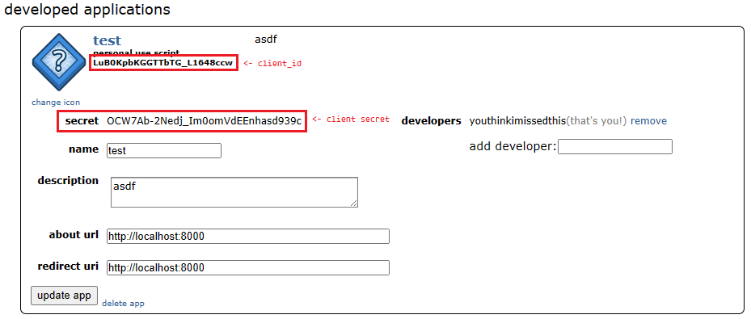

# Reddit Comment Nuker

Basically, I wanted to learn Python, and I wanted to get rid of all my Reddit comments. Not just get rid of them, but just for fun, change them into some nonsensical content.

# Instructions

> This ensures that you have Docker and Docker Compose installed.

1. Create an "App" on Reddit, using the account who's comments you want to nuke. Here's how:
   -  Go to [Reddit Preferences](https://www.reddit.com/prefs/apps)
   -  Click on **Create another app**
   -  Select the **script** radio button
   -  Enter a **Name** and **Description** (you can input anything you like, it doesn't really matter)
   -  In the **about url** and **redirect url**, input `http://localhost:8000` (I think this doesn't really matter as well, but it's what I entered.)
   -  Click on **Create app**
   -  Take note of the **secret** and **client_id**:
   
2. When you clone this project, you'll see the following files:
    ```tree
    reddit_comment_nuker/
    ├── config.ini.sample
    ├── docker-compose.yaml
    ├── Dockerfile
    ├── reddit_comment_nuker.py
    └── requirements.txt
    ```
3. Copy the `config.ini.sample` to `config.ini` and modify it to include the details as shown below:
   ```ini
   [reddit]
   client_id=LuB0KpbKGGTTbTG_L1648ccw
   client_secret=OCW7Ab-2Nedj_Im0omVdEEnhasd939c
   username=youthinkimissedthis (your actual Reddit username)
   password=supersecurepassword (your actual Reddit password) 
   # seems unsafe but it seems it won't run without it. 
   # you're probably deleting your account anyway ¯\_(ツ)_/¯
   ```
4. Run the following to start up the container:
   > This will rewrite **ALL** your Reddit comments (up to 999 I think, I don't know how to do more). This is **IRREVERSIBLE**.  
   > Be very sure you want to do this before continuing.
   ```bash
   docker-compose up -d --build
   ```
5. The container should start up and because of the `-d` option, will run in the background. If you want to see the output, you can either:
   1. Go to Reddit and see your comments being changed.
   2. Type `docker-compose logs -f` to see the (fairly useless) log:
      ```bash
      ...
      reddit_comment_nuker  | Changing comment 364.
      reddit_comment_nuker  | The new comment will have 7 nonsensical paragraphs.
      reddit_comment_nuker  | Done!
      reddit_comment_nuker  | Changing comment 365.
      reddit_comment_nuker  | The new comment will have 8 nonsensical paragraphs.
      reddit_comment_nuker  | Done!
      ...
      ```
      If you want to see more in there you can go into the `reddit_comment_nuker.py` and add more `print()` statements wherever you want.